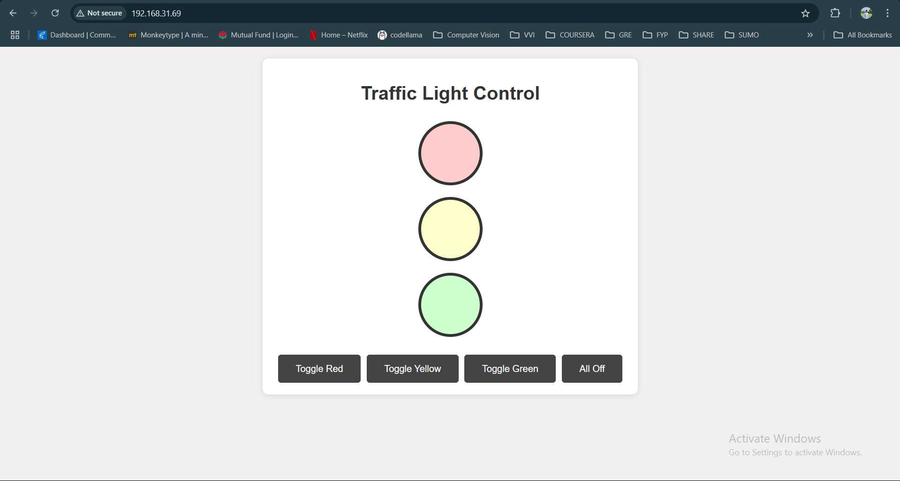

# ESP32 Traffic Light Control

This project uses an ESP32 microcontroller to create a Wi-Fi-based traffic light control system. It features a web interface for toggling red, yellow, and green lights in real time. The project can serve as a foundation for smart traffic systems or IoT-based experiments.

## Features

- **Wi-Fi Control**: Control the traffic light states (Red, Yellow, Green) through a web interface.
- **Real-time Updates**: Reflects the state changes instantly in the browser.
- **Minimal Hardware**: Requires only an ESP32 and three LEDs.(Note: I used arduino uno to program esp32 cam due to unavailability of ttl connector;stuck at how to code with arduino on esp32 cam?? watch out my repo!!!)

## Hardware Requirements

- **ESP32 Development Board(Arduino alsoin case of no ttl connector)**
- **3 LEDs** (Red, Yellow, Green)
- **3 Resistors** (220 ohms (optional))
- Breadboard and jumper wires for connections

## Software Requirements

- Arduino IDE
- ESP32 Board Manager (install via Arduino IDE)
- A text editor for code editing

## Setup Instructions

1. **Hardware Setup**:
    - Connect the LEDs to the ESP32 GPIO pins as follows:
      - **Red LED**: GPIO 15
      - **Yellow LED**: GPIO 4
      - **Green LED**: GPIO 2
    - Connect the LED cathodes to GND through resistors.
    - Ensure all connections are stable.

2. **Software Configuration**:
    - Install the ESP32 board in Arduino IDE following [this guide](https://docs.espressif.com/projects/arduino-esp32/en/latest/installing.html).
    - Open the `traffic_light_control.ino` file in Arduino IDE.
    - Replace the Wi-Fi credentials with your SSID and password:
      ```cpp
      const char* ssid = "Your_SSID";
      const char* password = "Your_Password";
      ```
    - Compile and upload the code to your ESP32.

3. **Accessing the Web Interface**:
    - After uploading, open the Serial Monitor to find the ESP32's IP address.
    - Enter the IP address in a browser to access the traffic light control panel.

## File Descriptions

- **`traffic_light_control.ino`**: Contains the Arduino sketch for controlling the LEDs and serving the web interface.
- **`README.md`**: Documentation and setup instructions for the project.

## Usage

- Open the web interface in a browser.
- Use the buttons to toggle the state of each light:
  - Red, Yellow, Green, or All Off.

## Demo




## Contributing

Feel free to fork the repository, make changes, and submit pull requests. Suggestions and feature requests are welcome.

## License

This project is licensed under the MIT License. See the `LICENSE` file for details.
